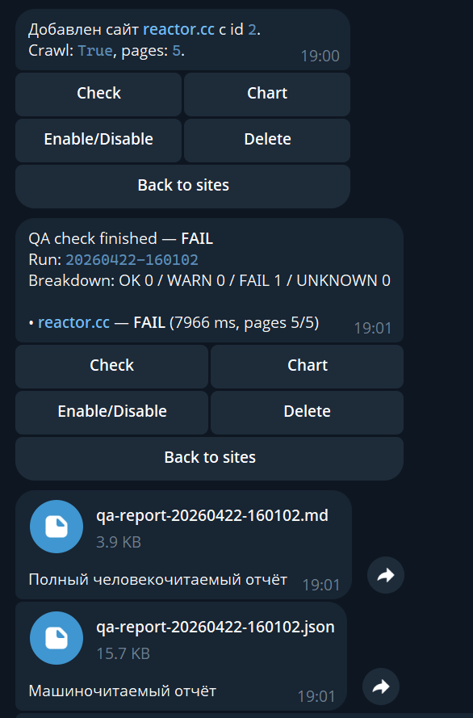
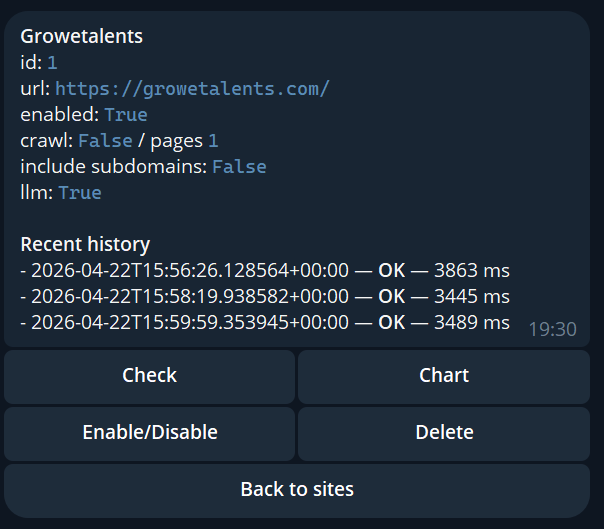
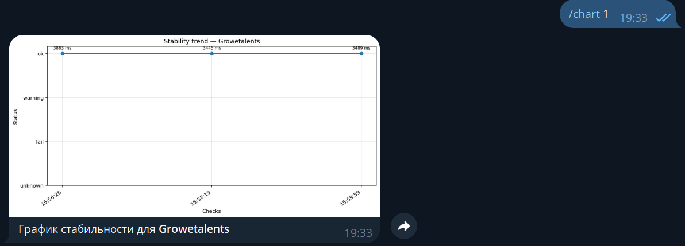

# QA Guard Bot

Production-style Telegram bot for continuous monitoring of public web pages with a strict split between deterministic checks and cautious LLM-based review.

The project demonstrates a pragmatic website QA workflow:
- monitor one or more public pages on a schedule;
- run objective checks with normal code first;
- escalate to Gemini only when a page looks suspicious or when a manual review is requested;
- persist site configuration, runtime settings, and stability history locally;
- send a human-readable report and a machine-readable report to Telegram;
- keep alerting conservative by filtering common third-party noise such as analytics failures.

This repository is intentionally focused on **decision quality, alert quality, and operational boundaries**, not on synthetic “AI everywhere” behavior.

## Why this project exists

Most broken pages are discovered too late — through users, ad campaigns, or support tickets.

The easy part is checking HTTP status. The hard part is deciding whether a page is **actually usable** and whether a detected anomaly is **worth alerting on**.

This bot is built around that principle.

## Core capabilities

- Telegram bot built on `aiogram` 3.x
- browser-based inspection with Playwright
- selective Gemini review with structured JSON output
- local SQLite storage for:
  - monitored site definitions;
  - runtime monitoring settings;
  - per-site run history;
- scheduled background monitoring with configurable interval
- Telegram-driven site management:
  - add a site;
  - remove a site;
  - enable or disable a site;
  - run an ad-hoc check;
- bounded crawl for multi-page summaries
- stability chart generation per site
- Markdown and JSON report generation
- alert deduplication mode through “notify only on changes”

## What the bot does

1. Loads monitored sites from SQLite.
2. Opens each target page in Playwright.
3. Collects deterministic signals such as status code, visible text, required selectors, console errors, failed requests, and crash-like signatures.
4. Optionally checks a limited number of internal pages through a bounded crawl.
5. Sends a screenshot plus a compact page summary to Gemini only when LLM review is enabled and justified.
6. Merges deterministic and LLM signals into a final status:
   - `ok`
   - `warning`
   - `fail`
   - `unknown`
7. Stores the result in SQLite and writes Markdown/JSON reports to disk.
8. Sends Telegram alerts when the scheduler is enabled and notification rules allow it.

## Monitoring policy

The system is designed to prefer a conservative warning over a confident false alarm.

### Deterministic checks
Used for everything measurable and reproducible.

Typical examples:
- HTTP status code;
- missing required selectors;
- missing required text;
- empty or nearly empty body text;
- uncaught page errors;
- excessive console errors;
- failed same-origin or relevant requests;
- obvious crash signatures such as `500`, `Internal Server Error`, `Traceback`, or `Something went wrong`.

### LLM review
Used only for narrow visual and semantic judgment.

Gemini is asked a constrained question:
- does this page look like a legitimate, readable, user-facing page;
- or does it appear visually or semantically broken?

The LLM is **not** supposed to invent business logic, infer hidden backend issues, or claim that flows work without evidence.

## Boundary between code and LLM

This repository deliberately separates the two layers.

### Code decides everything objective
Normal code handles:
- HTTP response evaluation;
- selector and text presence;
- console and page errors;
- failed requests;
- text volume checks;
- crawl scoping;
- alert thresholds;
- persistence and deduplication.

This keeps the frequent monitoring path cheap, repeatable, and auditable.

### LLM decides only a narrow subjective layer
Gemini receives:
- a screenshot;
- a compact DOM-derived digest;
- a summary of objective checks;
- a strict JSON schema.

That makes the model useful without letting it dominate the workflow.

## How hallucination risk is reduced

- the prompt is framed around observable evidence only;
- the model is allowed to return uncertainty;
- the model is not the first gate — objective checks run before it;
- LLM review can be skipped entirely for healthy scheduled runs or disabled per site;
- noisy third-party request failures can be ignored by domain allowlist;
- a failed analytics beacon does not have to be treated as a broken product page.

## Current monitoring model

This version implements a practical monitoring bot, not a full enterprise monitoring platform.

That means:
- it can run scheduled checks and send alerts to configured Telegram chats;
- it can keep historical run data and render a stability chart;
- it can perform a limited internal crawl for a broader page summary;
- it does **not** implement distributed workers, external job queues, SLA escalation trees, or a full observability backend.

This should be stated clearly in production discussions.

## Crawl model and subdomain scope

The repository supports a **bounded crawl**, not unrestricted discovery.

That means:
- links are collected from the inspected page itself;
- only HTTP/HTTPS targets are considered;
- crawl depth is effectively bounded by a max page count;
- same-host crawling is allowed by default;
- sibling subdomains can be included only when explicitly enabled for that site.

It does **not** attempt to enumerate every possible subdomain on the internet or act like an external recon scanner.

## Architecture

```text
Telegram User / Alert Chat
    ↓
aiogram Router / Commands / Callback actions
    ↓
QA Orchestrator
    ├─ load sites and runtime settings from SQLite
    ├─ inspect pages with Playwright
    ├─ run objective checks
    ├─ optionally run bounded crawl
    ├─ optionally ask Gemini for structured verdict
    ├─ merge final status
    ├─ persist history to SQLite
    └─ write Markdown / JSON reports and send Telegram alerts
```

## Main components

### `qa_guard_bot/bot.py`
Application entrypoint and Telegram interface. Initializes:
- bot instance;
- dispatcher and router handlers;
- storage;
- monitor service;
- scheduler loop;
- commands, buttons, and reporting flow.

### `qa_guard_bot/monitor.py`
Main inspection and orchestration logic:
- Playwright page loading;
- deterministic checks;
- crawl handling;
- LLM attachment logic;
- background monitoring loop;
- notification decision logic.

### `qa_guard_bot/llm.py`
Gemini wrapper for structured page review.

### `qa_guard_bot/storage.py`
SQLite persistence layer for:
- site definitions;
- app settings;
- historical run records.

### `qa_guard_bot/reporting.py`
Human-readable and machine-readable report generation.

### `qa_guard_bot/charts.py`
PNG chart rendering for site stability trends.

### `qa_guard_bot/config.py`
Environment-driven application configuration and bootstrap site parsing.

### `qa_guard_bot/schemas.py`
Shared report and result schemas.

## Repository structure

```text
.
├── Dockerfile
├── requirements.txt
├── .env.example
├── run.py
├── qa_guard_bot/
│   ├── __init__.py
│   ├── bot.py
│   ├── charts.py
│   ├── config.py
│   ├── llm.py
│   ├── monitor.py
│   ├── reporting.py
│   ├── schemas.py
│   └── storage.py
└── reports/
    └── ... generated at runtime
```

## Tech stack

- Python 3.11+
- aiogram 3.x
- Playwright (Chromium)
- Google Gemini API
- SQLite
- matplotlib
- python-dotenv

## Configuration

Create `.env` from `.env.example`.

### Required variables

```env
TELEGRAM_BOT_TOKEN=...
GEMINI_API_KEY=...
```

### Full example

```env
TELEGRAM_BOT_TOKEN=1234567890:replace_me
GEMINI_API_KEY=replace_me
GEMINI_MODEL=gemini-3.1-flash-lite-preview

CHECK_INTERVAL_MINUTES=30
NOTIFY_ONLY_ON_CHANGES=true
SCHEDULER_ENABLED=true
PLAYWRIGHT_HEADLESS=true
PLAYWRIGHT_TIMEOUT_MS=25000
POST_LOAD_WAIT_MS=1500
LLM_MAX_PAGES_PER_RUN=3
LLM_FAIL_CONFIDENCE=0.82
TELEGRAM_ALLOWED_USER_IDS=
NOTIFY_CHAT_IDS=
REPORTS_DIR=reports
DB_PATH=qa_guard_bot.sqlite3

SITES_JSON=[
  {
    "name": "Main site",
    "url": "https://example.com",
    "required_texts": ["Example Domain"],
    "required_selectors": ["body", "h1"],
    "soft_expectations": "The page should look like a legitimate landing page with readable content and no broken or obviously missing layout.",
    "max_console_errors": 0,
    "max_page_errors": 0,
    "max_request_failures": 0,
    "min_visible_text_chars": 80,
    "llm_enabled": true,
    "screenshot": true,
    "crawl_enabled": true,
    "crawl_max_pages": 5,
    "include_subdomains": false,
    "ignored_failure_domains": [
      "google-analytics.com",
      "googletagmanager.com",
      "doubleclick.net"
    ]
  }
]
```

### Important settings

#### `CHECK_INTERVAL_MINUTES`
Default scheduler interval used for background monitoring.

#### `NOTIFY_ONLY_ON_CHANGES`
When enabled, the bot avoids sending repeated alerts for the same overall status signature.

#### `SCHEDULER_ENABLED`
Controls whether the background monitoring loop is active.

#### `TELEGRAM_ALLOWED_USER_IDS`
Optional comma-separated list of Telegram user IDs allowed to interact with the bot. When empty, the bot accepts any user who can reach it.

#### `NOTIFY_CHAT_IDS`
Optional comma-separated list of Telegram chat IDs that should receive background reports.

#### `LLM_MAX_PAGES_PER_RUN`
Caps the number of pages per run that may be sent to Gemini.

This matters for free-tier usage and helps keep subjective review targeted instead of wasteful.

#### `LLM_FAIL_CONFIDENCE`
Confidence threshold used when interpreting LLM-driven fail-level signals.

## Site definition model

A monitored site can include:
- `url`
- `name`
- `required_texts`
- `required_selectors`
- `soft_expectations`
- `max_console_errors`
- `max_page_errors`
- `max_request_failures`
- `min_visible_text_chars`
- `llm_enabled`
- `screenshot`
- `crawl_enabled`
- `crawl_max_pages`
- `include_subdomains`
- `ignored_failure_domains`
- `enabled`

This allows one repository to handle both strict pages and softer marketing pages.

## Local setup

### Windows (PowerShell)

```powershell
python -m venv .venv
.\.venv\Scripts\Activate.ps1
pip install -r requirements.txt
playwright install chromium
Copy-Item .env.example .env
python -m qa_guard_bot.bot
```

### Linux / macOS

```bash
python -m venv .venv
source .venv/bin/activate
pip install -r requirements.txt
playwright install chromium
cp .env.example .env
python -m qa_guard_bot.bot
```

## Docker

The current repository ships with a Dockerfile, but before relying on it you should align the runtime entrypoint with the actual package name used by this repository.

Recommended container command:

```bash
docker build -t qa-guard-bot .
docker run --rm -it --env-file .env qa-guard-bot python -m qa_guard_bot.bot
```

If you want Docker to work without overriding the command, update `run.py` and `Dockerfile` to use the `qa_guard_bot` package entrypoint consistently.

## Telegram commands

- `/start` — open the main menu
- `/help` — show commands and usage
- `/run` — run checks for all enabled sites
- `/sites` — list configured sites and open site actions
- `/check https://site.tld` — run a one-off check for a URL
- `/addsite https://site.tld Name` — add a site to monitoring
- `/remove 3` — remove a site by ID
- `/settings` — show monitoring settings and alert controls
- `/chart 3` — render a stability chart for a site
- `/last` — send the most recent in-memory report

The bot also accepts a plain URL as a shortcut for ad-hoc checking.

## Example interaction

### Manual check path

User:
> /check https://growetalents.com

Bot:
> QA check finished — WARN  
> Run: `20260422-152038`  
> Breakdown: OK 0 / WARN 1 / FAIL 0 / UNKNOWN 0

### Monitoring setup path

User:
> /addsite https://example.com Main site

Bot:
> Added site `Main site` with an internal ID and enabled crawl defaults.

### Stability chart path

User:
> /chart 3

Bot:
> Sends a PNG chart for the selected site's recent monitoring history.

## Screenshots




## Persistence and auditability

The project keeps two different forms of runtime output.

### SQLite history
Stored per run and per site:
- run ID;
- trigger source;
- site ID;
- site name;
- site URL;
- final status;
- HTTP status;
- duration;
- timestamp.

### File reports
For each run, the bot writes:
- `latest_report.json`
- `latest_report.md`
- run-scoped copies under `reports/<run_id>/`

This makes the project easier to review, demo, and debug.

## Alerting behavior

Background alerts are sent only when:
- `NOTIFY_CHAT_IDS` is configured;
- the scheduler is enabled;
- and either repeated alerts are allowed or the overall status signature changed.

This is intentionally simple and should be viewed as a baseline implementation rather than a full incident management policy.

## Operational limitations

The current repository is intentionally lightweight. Before shipping to a real production environment, you would usually add:
- proper secrets management instead of plain local `.env` files;
- retry, timeout, and backoff policies around Telegram and Gemini calls;
- metrics and structured observability;
- distributed scheduling or external workers;
- role-based admin controls;
- authentication/session support for protected pages;
- baseline screenshot diffing;
- tests and CI;
- rate limiting and abuse controls;
- richer alert routing beyond Telegram.

## Recommended production next steps

1. Add page profiles for different classes of targets such as landing pages, docs, auth screens, and dashboards.
2. Add retries and smarter severity rules for first-party API failures.
3. Persist richer report payloads in storage, not only summary history.
4. Add screenshot baseline comparison for layout regressions.
5. Add webhook deployment mode and process supervision.
6. Introduce regression tests for monitoring rules and LLM verdict parsing.
7. Separate notification policy from monitoring policy for cleaner escalation rules.

## Security notes

- Do not commit `.env` to the repository.
- Treat `TELEGRAM_BOT_TOKEN` and `GEMINI_API_KEY` as secrets.
- Restrict bot access with `TELEGRAM_ALLOWED_USER_IDS` when deploying outside a private environment.
- Review screenshots and reports before sending them to shared chats if monitored pages may contain sensitive information.
- SQLite is acceptable for local and small-scale deployments but is not ideal for multi-process, high-concurrency production monitoring.

## Troubleshooting

### The bot starts but does not answer in Telegram
Check:
- `TELEGRAM_BOT_TOKEN` is valid;
- the bot is not blocked by the target user/chat;
- polling is not conflicting with an existing webhook;
- `TELEGRAM_ALLOWED_USER_IDS` is not filtering the caller unexpectedly.

### Playwright checks fail even though the site loads in a normal browser
Check:
- Chromium was installed with `playwright install chromium`;
- headless mode is not being blocked by the target site;
- third-party analytics failures are not being treated as product failures;
- timeouts are high enough for the target site.

### The bot produces too many warnings
Reduce noise by:
- expanding `ignored_failure_domains` for non-critical third-party services;
- relaxing `max_request_failures` where appropriate;
- raising the evidence bar for fail-level interpretations.

### The bot misses broken pages
Tighten the monitored site config:
- add `required_selectors`;
- add `required_texts`;
- increase crawl coverage for multi-page sites;
- keep LLM review enabled on visually important pages.

### Charts do not render
Check:
- there is enough site history for at least two runs;
- `matplotlib` is installed correctly;
- the reports directory is writable.

## License / usage

This repository is suitable as a demo project, technical assignment deliverable, or base template for a cautious website QA assistant.

The next practical upgrade is straightforward: move from a single-node Telegram monitoring bot to a more complete monitoring service with stronger observability, richer routing, and environment-specific page profiles.
